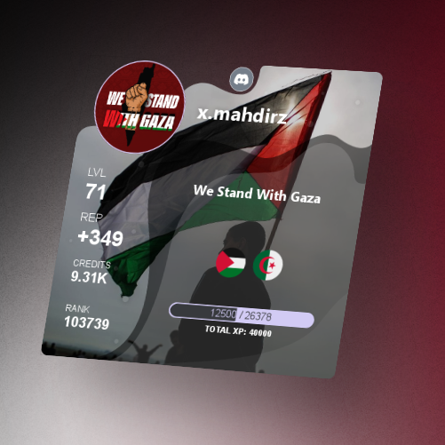

# 🎨 Discord Bot Profile Image 

<div align="center">
  <p style="font-size: 20px; font-weight:600;" >Probot Profile Command</p>
 
</div>


## Overview

This Discord bot generates profile images similar to the popular bot `Probot`. The bot responds to commands to display a profile card with user-specific information, including avatars, levels, reputation, credits, and rank *(static info ~ fake data)*.

## 🌟 Features

- 🖼️ Generates a profile card on command.
- 👤 Displays user avatar and server (guild) icon.
- 📊 Shows user-specific information such as level, reputation, credits, and rank.
- 🎨 Includes graphical elements like backgrounds, shadows, and badges.

## 📜 Command Definition

The `profile` command is defined using `SlashCommandBuilder` and can be used as both a prefix and a slash command.

```javascript
const { SlashCommandBuilder } = require("@discordjs/builders");

exports.commandBase = {
  prefixData: {
    name: "profile",
    aliases: ["pro"],
  },
  slashData: new SlashCommandBuilder()
    .setName("profile")
    .setDescription("Shows a profile card"),
  cooldown: 5000,
  ownerOnly: false,
  async prefixRun(client, message, args) {
    await generateProfileCard(message, message.author, message.guild);
  },
  async slashRun(client, interaction) {
    await generateProfileCard(
      interaction,
      interaction.user,
      interaction.member.guild
    );
  },
};
```

## 🛠️ Profile Card Generation

The profile card is generated using the `generateProfileCard` function, which utilizes the `canvas` library to draw elements on a canvas.

### 🎨 Elements Drawn

- **🌆 Background and Shadows**: Loaded from assets and drawn on the canvas.
- **👥 User Avatar and Server Icon**: Loaded from URLs and drawn with circular clipping.
- **🏅 Badges**: Drawn below the avatars.
- **ℹ️ User Information**: Static text such as username, level, reputation, credits, and rank.
- **📈 Progress Bar**: Represents the user's progress towards the next level.

## 🔢 Static Data

**Important Note:** The following static data is used in the code and should be updated with dynamic or correct values:

- User XP information:
  - `level = 71`
  - `rep = +349`
  - `credits = 9.31K`
  - `rank = 103739`
  - `currentXP = 12500`
  - `maxXP = 26378`
  - `totalXP = 40000`
- Status text: `const status = "We Stand With Gaza";`

Ensure to replace these values with appropriate dynamic data fetching mechanisms or correct static values based on your use case.

## 📂 File Structure

The project has the following structure:

```
/src
│   config.js
│
├───assets
│   ├───backgrounds
│   │       bg.png
│   │
│   ├───badges
│   │       dzFlag.png
│   │       psFlag.png
│   │
│   ├───shadows
│   │       sh1.png
│   │       sh2.png
│   │       sh3.png
│   │       sparkles.png
│   └───shot.png

├───commands
│   └───info
│           ping.js
│           profile.js
│
├───events
│       interactionCreate.js
│       messageCreate.js
│       ready.js
│
└───utils
        commandHandler.js
        eventHandler.js
        functions.js
index.js
package.json
readme.md
```

## ⚙️ Configuration

- `config.js`: Contains bot configuration settings `prefix`, `token`, `owner:id`.
- `assets/`: Directory for storing image assets used in profile cards.
- `commands/`: Directory for command definitions.
- `events/`: Directory for event handlers.
- `utils/`: Utility functions and handlers.

## 🚀 Running the Bot

Install the required dependencies:

```bash
npm install
```

Start the bot:

```bash
npm start
```

For development with automatic restarts on file changes:

```bash
npm run dev
```

## 📦 Dependencies

- `canvas`: For drawing images on a canvas.
- `discord.js`: Discord API wrapper.
- Other utilities such as `node-fetch` and `path`.

## 📌 Note
- The template source is from the repository: [v14-slash-command-handler](https://github.com/memte/v14-slash-command-handler) 📁.

## 📜 License

This project is licensed under the MIT License.